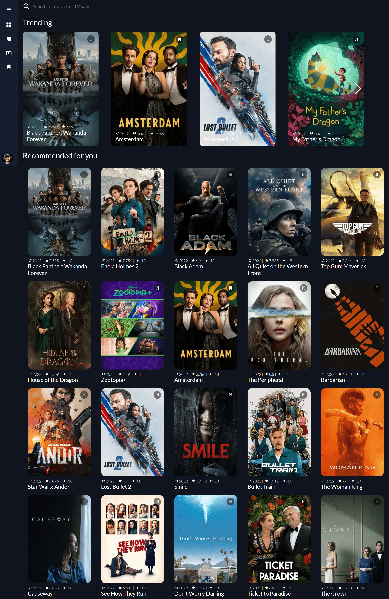
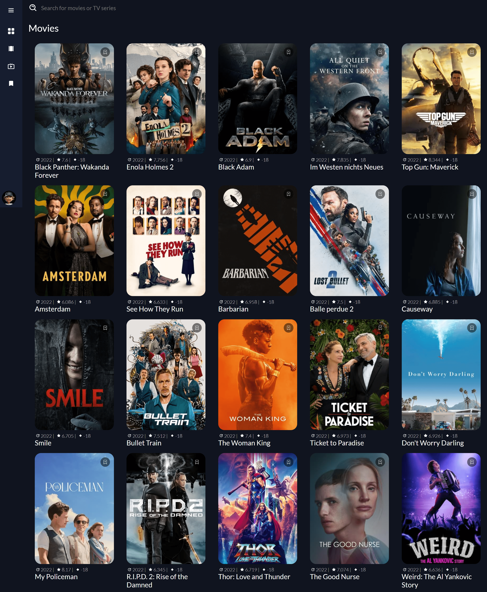
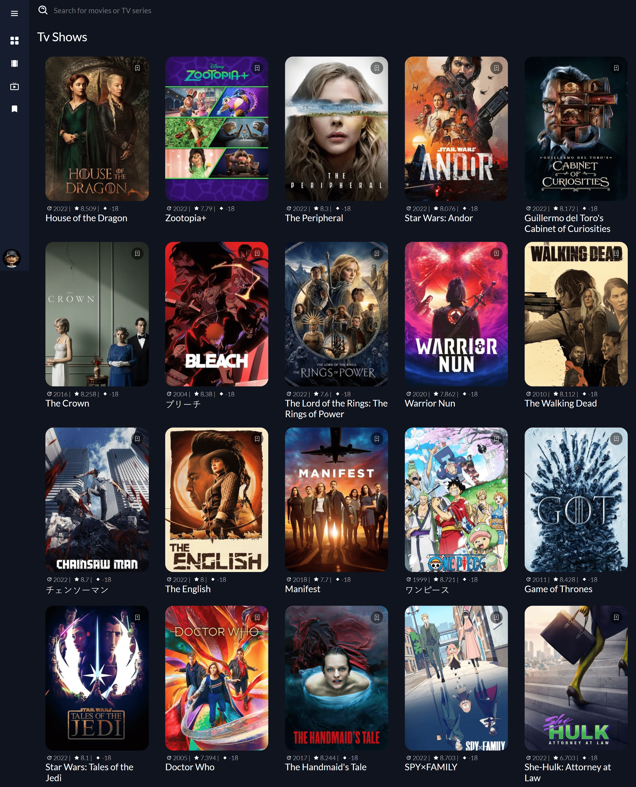
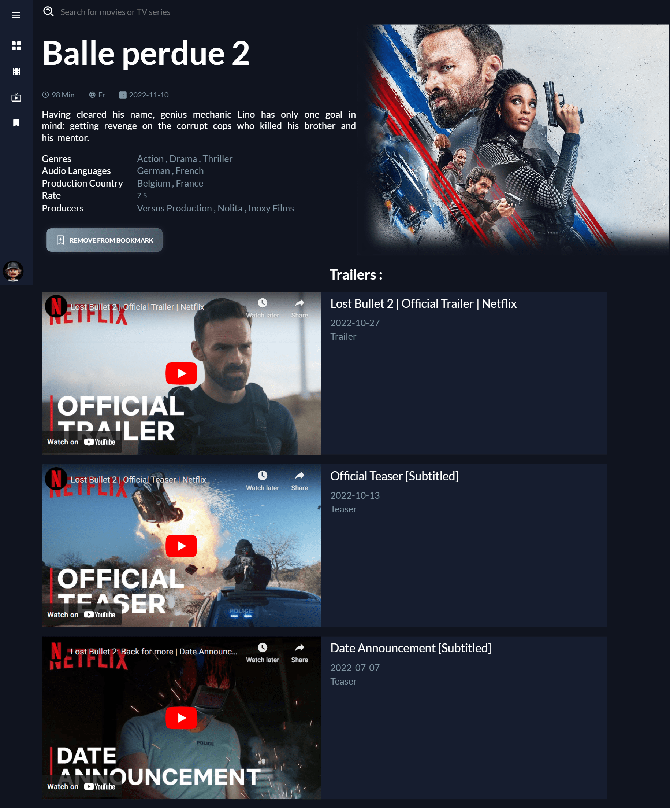
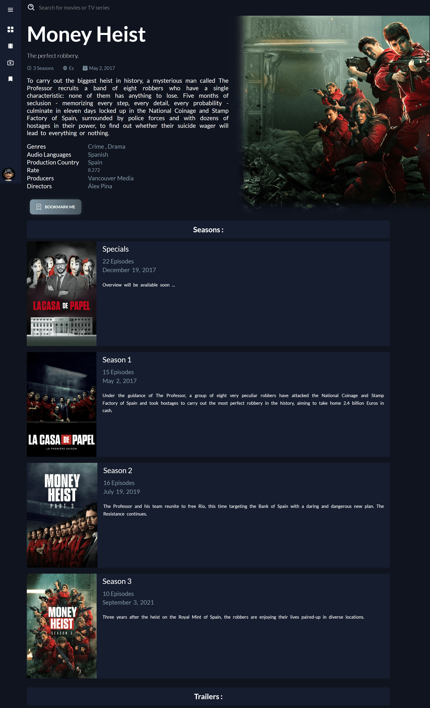
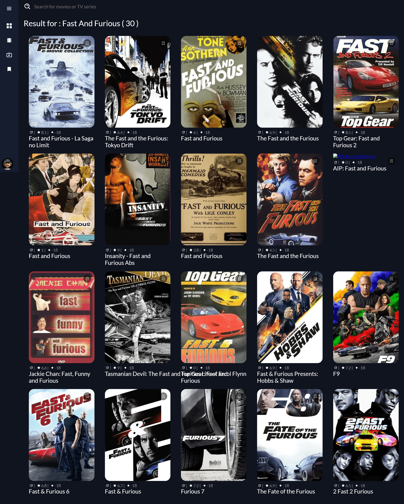
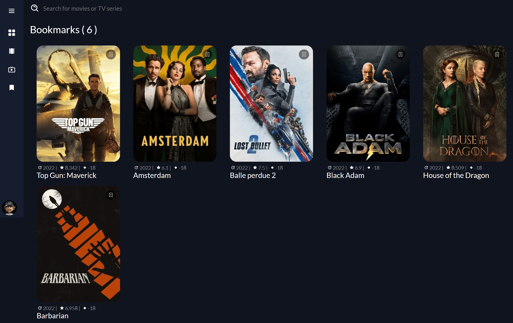

# MovieMe-App

MovieMe App is a web application which provides details about latest movies and tv shows , Trailers ....

## Table of contents

- [Overview](#overview)
  - [The challenge](#the-challenge)
  - [Screenshot](#screenshot)
  - [Links](#links)
- [My process](#my-process)
  - [Built with](#built-with)
- [Author](#author)

## Overview

### The challenge

The App is providing information about latest movies and tv shows , in the Home page , you can view all the movies and tv shows that exist in the internet , views details and also trailers , also you can search about an actor and the app search for his tv-shows or Movies
The User can also bookmark the movies and tv-shows that he likes and get back to them whenever he wants without registering or making an account .

### Screenshot

#### Home Page

#### Movies Page

#### Tv-shows Page

#### Movies Article

#### Tv-show Article

#### Search Page

#### Bookmarked Page

### Links

- Solution URL: [Click Me !](https://github.com/aymendev1/MovieMe-App)
- Live URL: [Click Me !](https://moviemeappaymendev1.netlify.app/)

### Built with

- ReactJS
- React Components...
- NodeJS
- ExpressJS
- REST API
- TheMovieDB API

## Author

- Website - [Aymen's Portfolio](https://www.aymendev1.com)
- LinkedIn- [@aymanazougar](https://www.linkedin.com/in/aymanazougar/)
